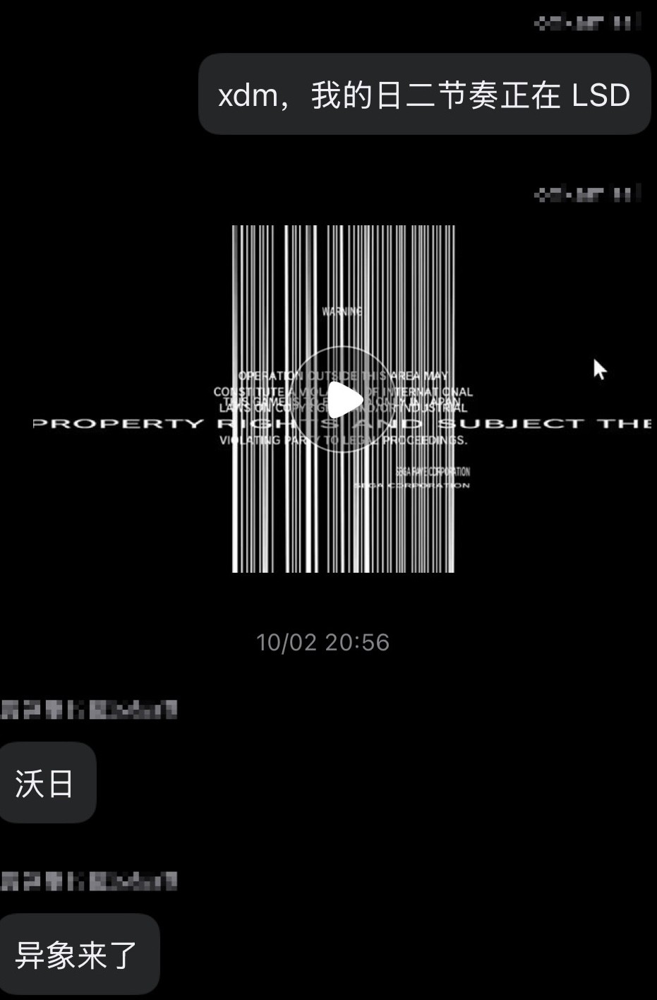
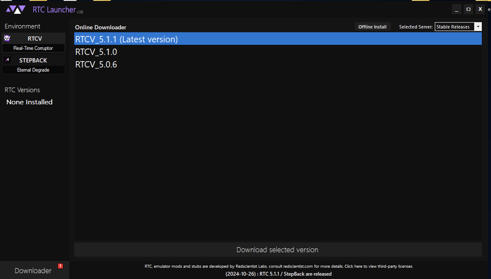
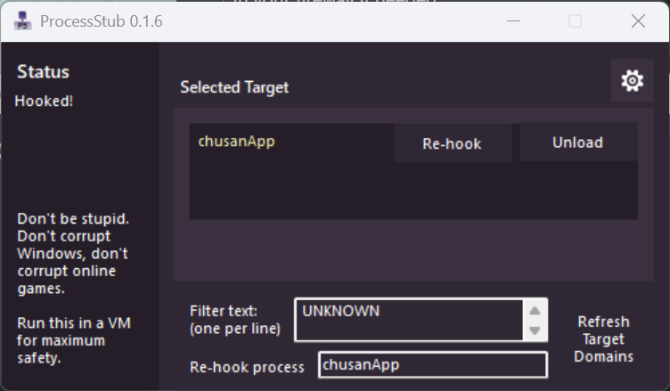
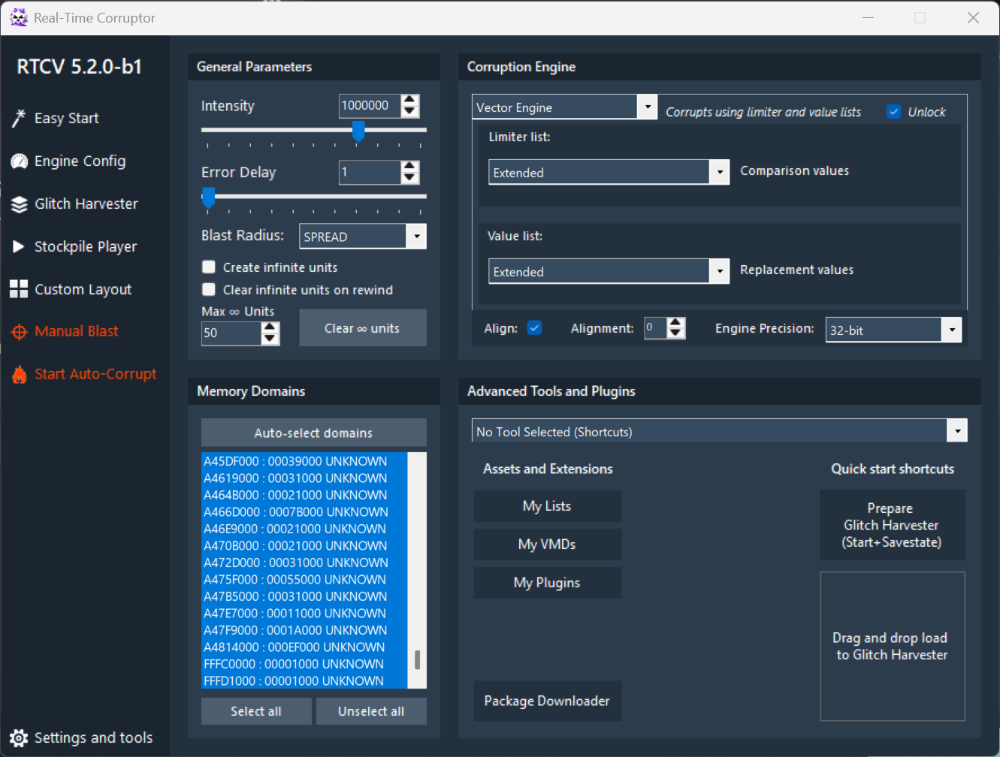

 
## 前置知识

### 什么是异象

使用 ~~技术手段~~，我们可以读/写游戏的内存。通过对游戏定向/不定向地覆写它的内存，让其发生未预期的行为和表现，这就是 ==**异象 (Anomaly)**==。

这样覆写内存，很容易可以修改一些 UI 元素的大小/旋转/拉伸/翻转/颜色 etc.（因为内存里主要是这些），也有小几率可以修改游戏逻辑，因为这要求游戏代码被修改后仍能够（某种程度上的）正常运作。例如之前呈现的 GIF 图片，因为决定摄像头位置和旋转的视图矩阵（游戏的具体实现未知，仅是个人猜测，但是本质上原理是一样的）被垃圾数值覆盖，所以出现了位置改变+旋转的效果。有时音频也有可能被损坏。

### 关于异象的提醒

虽然异象看起来很酷，==**但是也对你和你的电脑有潜在的危险。**==

因为异象的不确定性，可能会出现整个屏幕因为被损坏的 UI 等出现**高频闪烁**等行为。==**如果你对此类闪光敏感（光敏性癫痫等），请不要自己尝试进入异象。**==

同时，进入异象如果火力太大**可能会导致电脑蓝屏**，虽然概率很小，但是建议先保存所有未保存的内容，防止数据丢失。

此外，==**不建议联网游玩**，可能会上传垃圾数据导致被 ban 号等不可挽回的后果。==

## 配置环境

本文默认假设您：
- 已经*通过某种手段*获得了中二节奏游戏软体 HDD。
- ==具有一台功能正常，外设齐全的个人电脑，并且可以正常运行中二节奏==。
- 没有令人费解的语言障碍。

### 下载并配置 RTCV

在 [Redscientist Labs](https://redscientist.com/rtc) 网站上下载 ==RTC 启动器== 安装包。

*系统要求*：Windows 10/11 x64 并且拥有一个性能尚可的 CPU/GPU。

启动下载的软件后，点击侧边栏的 `Environment - RTCV`，选择最新版，并按下 `Download selected version`。

*（当你缺少依赖项目时，RTC 启动器会自动提醒你下载，请按屏幕操作进行。）*

==安装时，请坐等和放宽。==安装后，应该可以看到主界面（版本可能不一样），你可能注意到你的 RTC 启动器比我的少一个选项。

不要急，我们还需要安装 ==ProcessStub==。你同样可以在[这里](https://redscientist.com/optional/processstub)下载到。

*安装方式*：将下载得到的 PKG 文件拖到 RTC 启动器窗口上，或者选择其中的 `Load Custom Package` (加载自定义安装包)。

安装完成后，会出现两个窗口。在小的那个窗口里，先在 `Filter text` 中输入  `UNKNOWN`，然后在上面的 `Selected Target` 中，按下 `Browse`，并选择你的中二节奏进程。

选择之后，你会发现另一个窗口有 b 动静。

如图配置 RTC 主窗口。

- 在右上角的 `Corruption Engine` 中选择 `Vector Engine`。
- 确保 `Limiter list` 和 `Value list` 都是 `Extended`。
- 勾选上右上角的 `✅ Unlock`。
- `Engine Precision` 选择 `32-bit`。
- 左上角的 `General Parameters` 中 `Intensity` 调到一个你喜欢的数值（1,000,000 是一个很好的出发点）。
- 点击右侧的 `Manual Blast`。
- 大功告成。

### 更多的参数

- ==不建议更换 `Corruption Engine`。==
- ==可以更换 `Limiter list` 和 `Value list`。==

`Limiter list` 是 `Vector Engine` 匹配的数据类型。`Value list` 是匹配到的地址替换的内容。

从 [corrupt.wiki](https://corrupt.wiki/rtcv/rtc/classic-vector-lists) 上获得的 List 类型和内容：

- `Extended`：低精度范围内的数值，从 -65536.00 到 +65536.00，包含很小的小数。
- `Extended+`：低精度范围内的数值，从 0 到 +65536.00，包含很小的小数。
- `Extended-`：低精度范围内的数值，从 0 到 -65536.00，包含很小的小数。
- `One`：数值 +1.00 和 -1.00。
- `One-`：数值 -1.00。
- `One+`：数值 +1.00。
- `SuperExtended_Wholes`：高精度范围内的整数和大数，从 -65536.00 到 +65536.00。
- `Tiny`：介于 -1.00 和 +1.00 之间的极小小数。
- `Two+`：数值 +2.00。
- `Whole`：低精度范围内的整数，从 -65536.00 到 +65536.00。
- `Whole+`：低精度范围内的整数，从 0 到 +65536.00。

==同时，也可以启用 `Auto-corrupt` 功能。==

通过 `Intensity` 和 `Error Delay` 来活的自动 Corrupt 效果。

`Error Delay` 是对生成的 `Intensity` 进行分割的参数。它决定了`Auto-corrupt` 每隔多少时间对游戏进行一次 Corrupt。

示例：
在 60fps 下运行 1 秒，`Intensity` 为 500、`Error Delay` 为 1，会生成 30,000 个单位。
在 120fps 下运行 1 秒，`Intensity` 为 30,000、`Error Delay` 为 120，也会生成 30,000 个单位。

[单位？](https://corrupt.wiki/rtcv/rtc/concepts-and-vocabulary#blastunit)

区别在于，第一种情况会持续不断地产生单位，而第二种情况则是每秒一次性生成一大块单位。

## 常见问题

Q：无法 hook 到中二进程上
A：==不要以管理员权限运行==

Q：hook 上去之后游戏崩溃
A：==请在游戏自检后，进入标题界面再 hook==

Q：游戏总是崩溃！！1
A：==火力小一点。==
