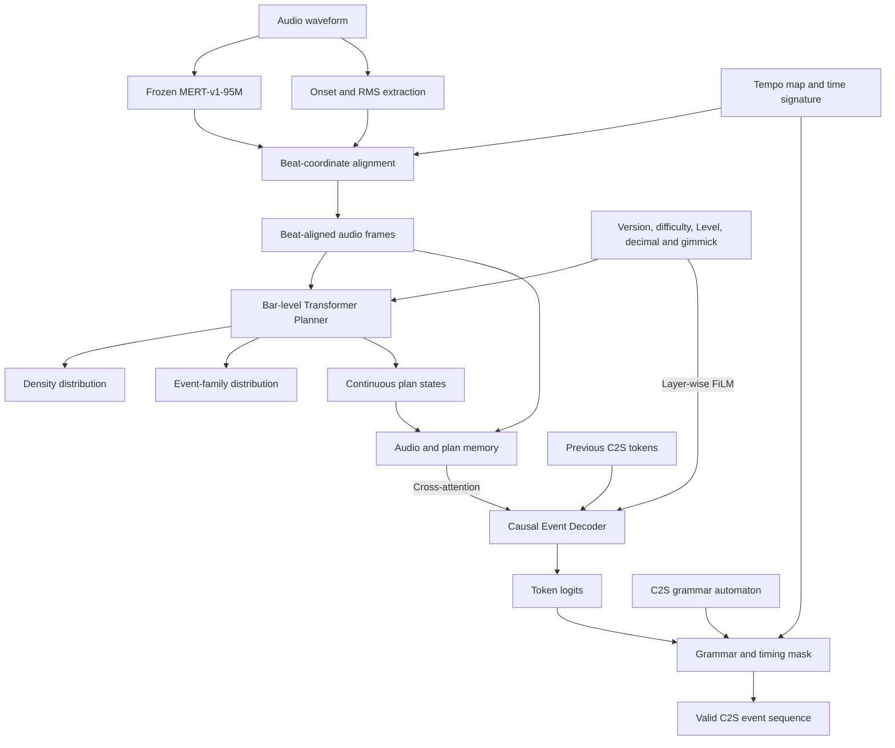
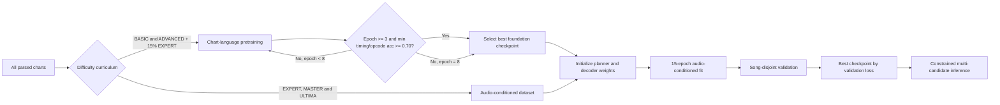

## BARGen-C2S：节拍坐标与形式语法约束下的音频条件游戏谱面生成

### 摘要

音频条件游戏谱面生成要求模型同时解决音乐结构理解、难度控制、长程动作组织与格式合法性四个问题。已有符号音乐生成方法通常假设输出序列本身即为音乐，而游戏谱面并不是音频的逐帧转写：同一首音乐可以对应多个难度、多个版本乃至不同设计风格的合法谱面。因此，该任务更适合建模为一个带有非唯一目标的条件结构预测问题，而不是传统的音频事件检测。

本文提出 BARGen-C2S，一种面向 C2S 谱面的节拍对齐层级生成方法。系统首先在显式 tempo map 上建立离散节拍坐标，将音乐表征、onset、能量和拍内相位对齐到小节；随后由小节规划器预测密度与音符家族分布，再由因果事件生成器输出时间增量、opcode、轨道、宽度和关联参数。版本、难度、Level、Level Decimal 与 gimmick 标志通过逐层条件调制注入网络。为避免模型生成不可解析序列，我们将 C2S 定义为确定性有限状态语法，并在解码时对非法 token 施加精确零概率，而不是依赖生成后的启发式修复。

在按歌曲 ID 隔离的验证集上，small 配置在拟合第 13 epoch 达到 82.97% 的全 token accuracy、84.65% 的 timing accuracy 和 78.79% 的 opcode accuracy，验证损失由 3.00 下降至 1.82。与此同时，音频对比损失在约 0.09 处提前进入平台，表明高 teacher-forcing accuracy 并不足以证明模型真正依赖音频。基于这一观察，本文进一步给出反事实音频替换评价：比较正确音频、跨歌曲错配音频和时间扰动音频下的条件似然，以区分谱面语言建模能力与听音写谱能力。当前结果支持节拍坐标、分项监督和语法约束的有效性，但完整的音频因果性结论仍需基线、消融和人工盲测验证。

**关键词：** 自动写谱；音乐信息检索；条件生成；Transformer；形式语言；节拍对齐；C2S

### 引言

节奏游戏谱面将音乐组织为一系列可操作事件。一个事件不仅包含发生时间，还可能包含轨道、宽度、持续时间、方向、父子关系和视觉修饰参数。谱面设计者需要在音乐对应性与可玩性之间取舍：落点应反映节奏、音色和段落结构，但不能把全部声学瞬态机械地映射为音符；高难度需要更高的信息密度和操作复杂度，但不能退化为随机加密。

设音频为 $x$，tempo map 为 $M$，控制条件为 $c$，谱面为 $Y$。目标分布为

$$
p(Y\mid x,M,c).
$$

该分布通常是多峰的。对于相同的 $(x,M,c)$，多个谱面都可能具有合理的节奏对应和可玩性。因此，以逐事件完全还原为唯一目标会产生两个问题。第一，验证准确率惩罚与参考谱不同但仍合理的设计；第二，模型可能通过记忆常见谱面语言获得较高准确率，而没有真正利用音频。

本文将任务拆为三个层次：

1. **音乐坐标层：** 在变 BPM 与变拍号条件下，将音频帧映射到统一 bar/tick 坐标。
2. **结构规划层：** 根据音频和难度条件预测各小节的事件密度与音符家族分布。
3. **语法生成层：** 在历史谱面、音频 memory 和形式语法约束下生成完整 C2S 事件。

本文的主要贡献如下。

- 提出一种保留完整 tempo map 的 C2S 规范化表示。它使用相对时间 token 表达事件，同时保留可逆的 96 tick/拍坐标。
- 提出规划器—生成器层级架构，将宏观难度控制与微观事件生成分离，并在每层注入版本、难度、Level、Decimal 与 gimmick 条件。
- 将 C2S 字段约束实现为确定性有限状态自动机，使非法轨道、缺失字段、无根 Slide 和非法关联在采样阶段即获得零概率。
- 区分 token、timing 与 opcode accuracy，并提出反事实音频替换指标，避免以总体 teacher-forcing accuracy 代替音频依赖证据。

### 相关工作

#### 符号音乐生成

基于 Transformer 的符号音乐模型已经能够生成具有中长程结构的 MIDI 或事件序列。Music Transformer 使用相对注意力改善音乐重复结构建模；Pop Music Transformer 以拍点为中心组织复合事件；Compound Word Transformer 将同一时间位置的多字段属性组合建模。这些工作证明了离散事件语言适合自回归生成，但其输出通常描述音乐本身，而非依赖音频、难度和可玩性共同决定的操作谱面。

#### 音频到谱面生成

早期音频到谱面方法多将问题分解为 onset 检测与规则映射。神经方法进一步使用卷积网络或序列模型预测离散落点。然而，只预测二值 onset 无法表达轨道几何、长条关系和复杂 opcode，也无法保证目标文件满足形式语法。本文不把谱面视为 onset 标签序列，而是将其视为带类型和参数的程序化事件语言。

#### 受约束序列解码

在程序生成、语义解析和结构化预测中，grammar-constrained decoding 常用于保证输出满足上下文无关语法或类型系统。C2S 的大部分局部合法性可以由确定性状态机描述；轨道、宽度和关联关系还需要少量动态状态。相比生成后修复，在线约束不会把概率质量浪费在必然被丢弃的候选上。

#### 可控生成与条件失效

条件生成模型可能忽略弱条件，尤其当自回归前文已经能够解释大部分目标时。游戏谱面具有强语言先验：常见节奏、事件字段顺序和局部动作模式均可由历史 token 推断。因此，即使模型接受音频 cross-attention，也不能据此断言它使用了音频。本文通过错配音频和时间扰动音频构造反事实输入，以测量条件依赖。

### 任务定义

#### 谱面事件

一张谱面由按绝对 tick 排序的事件组成：

$$
Y=(e_1,e_2,\ldots,e_N),
$$

$$
e_i=(t_i,o_i,l_i,w_i,\mathbf a_i,r_i).
$$

$t_i\in\mathbb N$ 为时间，$o_i$ 为 opcode，$l_i$ 为起始轨道，$w_i$ 为宽度，$\mathbf a_i$ 为持续时间、方向等参数，$r_i$ 表示可选的关联标识。普通轨道满足

$$
0\le l_i<16,\qquad 1\le w_i\le16-l_i.
$$

Slide、Hold 和 AIR-ACTION 等事件还受到父子关系、持续时间和目标轨道约束。

#### 控制条件

控制向量为

$$
c=(v_f,v,d,r,q,g),
$$

其中 $v_f$ 为版本族，$v$ 为具体版本，$d$ 为难度，$r$ 为整数 Level，$q\in\{0,10,\ldots,90\}$ 为 Decimal，$g$ 为 gimmick 标志。将 $r$ 与 $q$ 分开建模，可以在保持整数等级序关系的同时表达 `13.0` 与 `13.9` 的差异。

#### 条件生成目标

将事件序列编码为 token 序列 $\mathbf y=(y_1,\ldots,y_L)$，模型学习

$$
p_\theta(\mathbf y\mid x,M,c)
=\prod_{j=1}^{L}
p_\theta(y_j\mid y_{<j},x,M,c).
$$

训练采用 teacher forcing；推理时模型以自身输出作为历史。两者之间的分布偏移意味着 token accuracy 只能衡量条件似然拟合，不能直接等价为自由生成质量。

### 数据构建

#### 元数据与谱面解析

数据构建从 Music.xml 读取歌曲 ID、releaseTagName、难度、Level 和 Decimal，并将其与 C2S 和音频关联。解析器完整读取 timing opcode、音符 opcode、轨道几何、持续时间和事件关联。歌曲 ID、谱师名和游戏统计字段不作为生成目标。

在当前数据快照中，共有 7,999 张可索引谱面。容量审计会隔离单小节 token 数超过所选模型上限的谱面；WORLD'S END 默认单独划分，不参与普通难度课程训练。所有训练目标必须通过同一解析器进行 encode—decode 回环。

#### Song-disjoint 划分

划分单位为歌曲，而不是谱面文件。记歌曲集合为 $\mathcal S$，则

$$
\mathcal S_{\mathrm{train}}
\cap\mathcal S_{\mathrm{valid}}=\varnothing,
\qquad
\mathcal S_{\mathrm{train}}
\cap\mathcal S_{\mathrm{test}}=\varnothing.
$$

同一歌曲的 BASIC、ADVANCED、EXPERT、MASTER 和 ULTIMA 不得跨集合。该设计阻止模型在训练时见到同一音频的其他难度，从而避免验证泄漏。

#### 分段与上下文

目标窗口包含 8 个小节，另取此前 2 小节作为只读上下文。第 $k$ 个样本为

$$
(Y_{C_k},X_{C_k\cup B_k},Y_{B_k}),
$$

其中 $C_k$ 为历史区间，$B_k$ 为目标区间。上下文不包含未来事件。窗口按 epoch 旋转，使训练在固定计算预算下逐步覆盖长谱面的不同位置。

### 节拍坐标化音频表示

#### Piecewise-affine tempo map

tempo map 由变速点

$$
M=\{(u_j,b_j,m_j)\}_{j=1}^{J}
$$

组成，其中 $u_j$ 是起始 tick，$b_j$ 是 BPM，$m_j$ 是拍号。每拍使用 $R=96$ tick。若 $t\in[u_j,u_{j+1})$，则 tick 到秒的映射为

$$
s(t)=s(u_j)+\frac{60}{Rb_j}(t-u_j).
$$

该映射是分段仿射的，因此可精确积分变 BPM 音乐，而不是以全曲平均 BPM 近似。拍号决定小节长度：

$$
L_j=R\cdot n_j\cdot\frac{4}{d_j},
$$

其中 $n_j/d_j$ 为当前 time signature。

#### 音频特征

音频以 24 kHz 单声道输入冻结的 MERT-v1-95M，得到

$$
H^{\mathrm{MERT}}\in\mathbb R^{F\times768}.
$$

随后拼接 onset strength、RMS energy 以及节拍相位的正余弦编码。第 $f$ 帧相对于当前拍的归一化位置为 $\rho_f\in[0,1)$，相位表示为

$$
(\sin2\pi\rho_f,\cos2\pi\rho_f).
$$

相同方法用于小节相位。最终特征在 tempo map 上重采样到每小节固定帧数，使不同 BPM 下相同音乐位置具有相同张量坐标。

### BARGen-C2S

#### 架构总览

BARGen-C2S 不是一个直接把整首音频映射成整张谱面的黑盒网络，而是由音频前端、小节规划器、事件生成器和约束解码器串联而成：



冻结的 MERT 负责提取音色、和声、节奏纹理等高层音乐表征；onset 与 RMS 提供更直接的瞬态和能量信息；tempo map 则负责把这些连续时间特征转换到离散谱面坐标。三者的职责不同：MERT 回答“听起来是什么”，onset 回答“哪里发生了瞬态”，tempo map 回答“这个瞬态位于第几小节、第几拍和第几个 tick”。

小节规划器先观察完整的 8 小节目标片段，为每一小节预测事件密度和音符家族分布，并产生连续 plan state。它不决定某一个 TAP 应放在第几轨，而是建立段落轮廓，例如副歌是否应增密、空拍是否应留白、某一小节是否更适合长条或 AIR。这样，事件生成器不必在每一步同时推断宏观结构和局部字段。

事件生成器随后进行自回归写谱。它的一侧通过 causal self-attention 阅读此前的 C2S token，因此能够延续交替手序、重复型、Hold 和 Slide 路径；另一侧通过 cross-attention 阅读逐帧音频与 planner state，因此可以根据当前音乐片段调整落点和音符类型。最后，语法自动机和 tempo-aware timing mask 删除非法输出概率。模型负责在合法集合内判断“哪个选择更像目标谱面”，自动机负责判断“哪些选择根本不允许出现”。

采用层级结构而非单一 Transformer 有三个原因。第一，音频帧数与谱面 token 数之间不存在一一对应，先按小节规划可缓解两种时间尺度不一致。第二，难度主要影响段落密度、音符家族比例和操作复杂度，显式 planner 比仅依赖 decoder 隐状态更容易监督和校准。第三，C2S 的合法性是确定规则，不应要求神经网络通过样本近似学习；将语法交给自动机可以把模型容量保留给音乐对应性和设计风格。

#### 层级条件嵌入

条件嵌入为

$$
e_c=e_{v_f}+e_v+e_d+e_r+e_q+e_g+
\operatorname{MLP}
\left[
\frac d5,
\frac r{31},
\frac q{90},
\frac{r+q/100}{31.9}
\right].
$$

每个 Transformer block 使用 FiLM 调制：

$$
\operatorname{FiLM}(h,e_c)
=h\odot(1+\gamma(e_c))+\beta(e_c).
$$

相比仅添加首 token，逐层调制能在长序列中持续保留控制条件。

#### 小节规划器

对第 $b$ 个小节，将其中音频帧池化为 $\bar x_b$。规划器输入为

$$
z_b^{(0)}=W_x\bar x_b+W_m m_b+p_b,
$$

其中 $m_b$ 为节拍与拍号特征，$p_b$ 为小节位置嵌入。经过 Transformer Encoder 后得到 $z_b$，并预测密度类别与音符家族分布：

$$
p(d_b\mid x,M,c)=\operatorname{softmax}(W_dz_b),
$$

$$
p(f_b\mid x,M,c)=\operatorname{softmax}(W_fz_b).
$$

规划器描述“这一小节应该多密、主要由什么组成”，但不直接输出具体音符。

#### 事件生成器

事件生成器为因果 Transformer。音频帧和规划表示被投影后拼接为 memory：

$$
H^{\mathrm{mem}}=
[W_aH^{\mathrm{audio}};W_pZ^{\mathrm{plan}}].
$$

第 $l$ 层进行

$$
h' = h+\operatorname{SelfAttn}
(\operatorname{FiLM}(\operatorname{LN}(h),e_c)),
$$

$$
h'' = h'+\operatorname{CrossAttn}
(\operatorname{FiLM}(\operatorname{LN}(h'),e_c),H^{\mathrm{mem}}),
$$

$$
h^{(l+1)}=h''+\operatorname{FFN}
(\operatorname{FiLM}(\operatorname{LN}(h''),e_c)).
$$

small 配置包含 8 个 decoder block，$d=384$，6 个注意力头，FFN 维数 1536；每隔一层使用音频 cross-attention。

从条件概率角度，planner 引入隐变量 $Z$，模型可以近似写为

$$
p(Y\mid x,M,c)
\approx
p_\psi(Z\mid x,M,c)
p_\theta(Y\mid Z,x,M,c).
$$

$Z$ 不是离散采样变量，而是由 planner 产生的连续小节状态。第一项学习全局结构，第二项学习事件细节。训练时两部分通过总损失联合优化；MERT 保持冻结，但从 planner 和 decoder 到音频投影层的梯度仍然存在。

decoder 的 memory 同时包含细粒度音频帧与低频 plan states。若只使用 plan state，模型可能丢失小节内部的瞬态位置；若只使用逐帧音频，模型又可能缺少跨小节密度轮廓。二者拼接使 cross-attention 可以在局部声学证据与宏观结构之间选择。

#### C2S tokenization

事件被拆为时间、类型和参数字段，例如：

```text
<event_start> dt:48 op:TAP lane:7 width:2 <event_end>
```

时间使用

$$
\Delta t_i=t_i-t_{i-1}
$$

而非全局绝对小节号。相对时间减少词表对歌曲长度的依赖，并使常见节奏间隔共享参数。96 tick/拍对应 4/4 小节内的 384 个离散位置。

### 形式语法约束

#### 自动机定义

令语法自动机为

$$
\mathcal A=(Q,\Sigma,\delta,q_0,F),
$$

其中 $Q$ 为状态集合，$\Sigma$ 为 token 词表，$\delta$ 为状态转移，$q_0$ 为初始状态，$F$ 为可接受状态。状态除字段位置外，还保存当前 opcode、轨道、宽度、Slide 根节点和待完成参数。

当前状态 $q_j$ 下允许集合为

$$
V(q_j)=\{v\in\Sigma:\delta(q_j,v)\text{ 已定义}\}.
$$

#### Masked decoding

设网络输出 logits 为 $z_j$，语法约束后的 logits 为

$$
\tilde z_{j,v}=
\begin{cases}
z_{j,v},&v\in V(q_j),\\
-\infty,&v\notin V(q_j).
\end{cases}
$$

因此

$$
p(y_j=v\mid\cdot)=\operatorname{softmax}(\tilde z_j)_v
$$

对所有非法 token 恒为零。该约束排除字段乱序、越界轨道、非法宽度、缺少 Slide root、零持续时间 continuation 和不完整事件。

#### Tempo-aware timing mask

语法合法不等于节拍合法。给定 tempo map 和用户选择的细分集合 $G$，允许时间位置为

$$
\mathcal T(M,G)=
\bigcup_b\left\{t_b+k\frac{L_b}{g}:g\in G,
k\in\{0,\ldots,g-1\}\right\}.
$$

时间 token 只有在累积位置属于 $\mathcal T(M,G)$ 时才允许输出。由此，变 BPM 改变 tick 到秒的映射，但不会破坏谱面在音乐拍点上的离散对齐。

### 优化目标

#### 加权负对数似然

基础损失为

$$
\mathcal L_{\mathrm{tok}}=
-\frac{\sum_jw_{y_j}\log
p_\theta(y_j\mid y_{<j},x,M,c)}
{\sum_jw_{y_j}}.
$$

音符类型相对 TAP 的权重为

$$
w_o=\operatorname{clip}
\left(
\left(\frac{n_{\mathrm{TAP}}}{n_o}\right)^{1/4},
w_{\min},w_{\max}
\right).
$$

四次方根缩放弱于频率倒数，可提高稀有 opcode 的梯度占比，同时避免 FLK 等类别支配训练。

#### Timing 与 opcode 辅助目标

令 $\Omega_t$ 和 $\Omega_o$ 分别为 timing token 与 opcode token 的位置集合：

$$
\mathcal L_t=-\frac1{|\Omega_t|}
\sum_{j\in\Omega_t}\log p_\theta(y_j),
$$

$$
\mathcal L_o=-\frac1{|\Omega_o|}
\sum_{j\in\Omega_o}\log p_\theta(y_j).
$$

预训练阶段使用

$$
\mathcal L_{\mathrm{pre}}=
\mathcal L_{\mathrm{base}}+0.35\mathcal L_t+0.25\mathcal L_o.
$$

这两个分项直接对应落点与音符类型，防止大量简单参数 token 抬高总体准确率。

#### 规划损失

规划损失为

$$
\mathcal L_{\mathrm{plan}}=
\mathcal L_{\mathrm{density}}
+\lambda_r\mathcal L_{\mathrm{reg}}
+\lambda_f\mathcal L_{\mathrm{family}}.
$$

其中密度使用分类交叉熵，回归项使用 Smooth-$L_1$，音符家族使用加权交叉熵。

#### 难度单调性

对同一音频构造较低难度条件 $c^-$，要求预测密度满足

$$
D(x,c)\ge D(x,c^-)+m.
$$

对应 hinge loss 为

$$
\mathcal L_{\mathrm{mono}}=
\max(0,m-D(x,c)+D(x,c^-)).
$$

该目标约束统计复杂度的序关系，但不要求高难谱面在每个位置机械增密。

#### 音频对比目标

对 batch 内随机置换 $\pi$，正确与错配音频的规划损失分别为 $P_i^+$ 和 $P_i^-$：

$$
\mathcal L_{\mathrm{audio}}=
\frac1B\sum_i
\max(0,\gamma+P_i^+-P_i^-),
\qquad\gamma=0.20.
$$

总损失为

$$
\mathcal L=
\mathcal L_{\mathrm{tok}}
+\lambda_p\mathcal L_{\mathrm{plan}}
+\lambda_m\mathcal L_{\mathrm{mono}}
+\lambda_g\mathcal L_{\mathrm{grammar}}
+\lambda_a\mathcal L_{\mathrm{audio}}.
$$

### 训练策略

#### 谱面语言预训练

预训练只学习规范化 C2S，不使用音频。数据由 BASIC、ADVANCED 和约 15% EXPERT 构成。每张 BASIC/ADVANCED 每 epoch 贡献一个旋转窗口。预训练最少 3 epoch、最多 8 epoch；从第 3 epoch 起，当

$$
\min(A_t,A_o)\ge0.70
$$

时可提前切换。$A_t$ 和 $A_o$ 只在 BASIC/ADVANCED 的 song-disjoint 验证集上计算。

#### 音频条件拟合

拟合阶段使用 EXPERT、MASTER 和 ULTIMA，并继承预训练权重。优化器为 AdamW，使用 BF16、梯度裁剪、EMA、5% warmup 和 cosine decay。small 配置峰值学习率为 $2.75\times10^{-4}$，最低学习率为峰值的 20%。



### 实验协议

#### 模型配置

| 部分 | small 配置 |
|---|---:|
| MERT | 95M，冻结 |
| Planner | 4 层，$d=320$，5 heads |
| Decoder | 8 层，$d=384$，6 heads |
| Decoder FFN | 1536 |
| 目标窗口 | 8 小节 |
| 历史上下文 | 2 小节 |
| 时间分辨率 | 96 tick/拍 |
| Micro batch | 4 |
| Gradient accumulation | 2 |

#### 基线

一篇可投稿论文至少需要以下基线；当前工程结果尚未完成全部基线实验，因此不得把未测结果写成优越性结论。

- **BPM-grid Random：** 按目标密度在节拍网格随机落点。
- **Chart LM：** 只有谱面前文和控制条件，不输入音频。
- **Audio-only Planner：** 音频预测密度后由规则映射事件。
- **Flat Transformer：** 无规划器的单阶段音频条件 Transformer。
- **Unconstrained Decoder：** 关闭 grammar mask，用生成后修复处理非法事件。
- **Constant-BPM：** 将完整 tempo map 替换为单一 BPM。

#### 评价指标

除 token accuracy 外，应报告：

$$
A_t=\frac{\#\text{correct timing tokens}}
{\#\text{timing tokens}},
$$

$$
A_o=\frac{\#\text{correct opcode tokens}}
{\#\text{opcode tokens}}.
$$

自由生成还应报告：

- **Parse Rate：** 可被独立 C2S 解析器读取的候选比例。
- **Rule Validity：** 通过轨道、持续时间和关联检查的比例。
- **Onset Alignment：** 生成事件与局部 onset 峰值的加权距离。
- **Beat Deviation：** 事件到最近合法节拍细分的平均 tick 距离。
- **Density Error：** 生成 judgements/min 与目标等级校准均值之差。
- **Opcode F1：** 按 TAP、HLD、SLD、AIR、FLK 分别计算 macro-F1。
- **Audio Reliance：** 正确音频与反事实音频的似然差。
- **Human Preference：** 双盲成对比较的可玩性和音乐对应性。

### 初步结果

#### 预训练

8 epoch 后，BASIC/ADVANCED 验证结果为：

| 指标 | 数值 |
|---|---:|
| Timing accuracy | 70.27% |
| Opcode accuracy | 70.29% |
| 全 token accuracy | 69.12% |

#### 音频拟合

当前可核验的拟合曲线如下。

| Epoch | Val loss | Token acc. | Timing acc. | Opcode acc. |
|---:|---:|---:|---:|---:|
| 5 | 2.0733 | 76.82% | 78.37% | 72.38% |
| 7 | 1.9713 | 79.71% | 81.29% | 75.52% |
| 10 | 1.8722 | 81.81% | 83.31% | 77.61% |
| 11 | 1.8507 | 82.30% | 83.90% | 78.14% |
| 12 | 1.8367 | 82.64% | 84.21% | 78.52% |
| 13 | 1.8227 | 82.97% | 84.65% | 78.79% |

验证损失和两项关键准确率均持续改善，但第 10 epoch 后边际收益显著减小。该趋势符合正常的后期收敛，不支持“训练完全没有梯度下降”的判断。

#### 音频损失

| Epoch | Val audio loss |
|---:|---:|
| 1 | 0.1206 |
| 4 | 0.1034 |
| 7 | 0.1011 |
| 10 | 0.0933 |
| 11 | 0.0919 |
| 12 | 0.0922 |
| 13 | 0.0944 |

音频损失前期下降约 24%，随后进入平台。由于使用 hinge loss，满足 margin 的 batch 损失为零，因此单 batch 的 `audio=0` 不能解释为没有音频梯度。然而，平台本身说明当前规划器级对比目标不足以证明 decoder 强依赖音频。

### 音频依赖的反事实检验

仅观察 $\mathcal L_{\mathrm{audio}}$ 不足以回答模型是否“听歌”。对验证样本构造三种输入：正确音频 $x$、跨歌曲错配音频 $x'$ 和保留能量但打乱时间顺序的音频 $\tilde x$。定义

$$
\Delta_{\mathrm{swap}}=
\mathcal L_{\mathrm{tok}}(x')-
\mathcal L_{\mathrm{tok}}(x),
$$

$$
\Delta_{\mathrm{shuffle}}=
\mathcal L_{\mathrm{tok}}(\tilde x)-
\mathcal L_{\mathrm{tok}}(x).
$$

若模型使用音频，则两者应显著大于零。统计检验以歌曲为单位进行 bootstrap，而非以 token 为单位，以避免长谱面获得不成比例的权重。报告 95% confidence interval：

$$
\operatorname{CI}_{95\%}
=\left[Q_{0.025}(\Delta^*),Q_{0.975}(\Delta^*)\right].
$$

在完成该实验前，本文只能声称模型具备音频条件接口和规划器级对比学习，不能声称已经证明强音频依赖。

### 消融实验设计

顶会级结论需要至少完成下列消融。

| 变体 | 要回答的问题 |
|---|---|
| 去除 tempo map | 变 BPM 坐标是否必要？ |
| 去除 planner | 层级规划是否改善密度与长程结构？ |
| 去除 grammar mask | 在线约束是否提高有效候选率？ |
| 去除 timing/opcode 辅助损失 | 分项监督是否提高关键准确率？ |
| 去除历史上下文 | 前 2 小节是否改善连续性？ |
| 去除音频 | 模型是否主要退化为 chart LM？ |
| 错配音频训练 | 当前 audio loss 是否识别音乐身份？ |
| 条件仅放首 token | 逐层 FiLM 是否改善难度控制？ |

每个变体至少使用三个随机种子。对连续指标报告均值、标准差和 paired bootstrap；对人工偏好使用 Bradley–Terry 模型或双侧 binomial test，并校正多重比较。

### 失败模式

当前系统存在四类可预期失败。

#### 语言先验压过音频

decoder 在 teacher forcing 下可以从真实前文预测常见模式，因而在不使用音频时仍能获得较高准确率。该问题必须通过音频消融识别，而不能由 cross-attention 的存在推断。

#### 稀有 opcode 欠拟合或过补偿

不加权时，FLK 等事件召回率低；权重过高时，生成谱面会出现异常密集的 FLK。四次方根权重和类别上限只是一种折中，最终仍应按类别报告 precision、recall 与生成频率偏差。

#### 合法但不可玩

grammar mask 保证的是句法合法性。合法的密集纵连、手位冲突或无意义 Slide 仍可能不可玩。可玩性需要几何约束、难度校准和人工偏好共同评价。

#### 分段边界不连续

2 小节历史能够传递局部动机，但无法完整表示跨越十余小节的主题复现。增加上下文会提高显存和解码成本；另一方向是使用低频全曲结构 token 或检索式段落 memory。

### 局限性与有效性威胁

- 当前结果来自单一模型规模和单一主要随机种子，不能估计训练方差。
- 尚未完成 BPM-grid、chart-only 和 flat Transformer 等必要基线。
- teacher-forcing 指标不能替代自由生成质量。
- 数据来自单一谱面生态，谱师风格和版本分布可能形成隐藏混杂变量。
- MERT 冻结降低过拟合与显存成本，但限制了音频表示对谱面任务的适配。
- WORLD'S END 被隔离，因此结论不适用于非常规轨道和极端 gimmick。
- 当前音频对比仅作用于规划器，无法直接约束 decoder 的 token 级音频敏感性。

### 结论

BARGen-C2S 将自动写谱建模为节拍坐标、层级规划、条件事件生成与形式语法共同约束的问题。现有实验显示，模型能够稳定学习 C2S 事件语言，timing accuracy 超过 84%，opcode accuracy 接近 79%，并在完整 tempo map 上输出可被语法自动机约束的候选。更重要的结果并不是某个 accuracy 数值，而是音频损失与 token 损失呈现不同的收敛行为：模型较早掌握“怎样写得像谱面”，但“怎样针对这首音乐写谱”仍是主要瓶颈。

因此，后续工作的优先级不应是盲目扩大模型或延长 epoch，而应是完成反事实音频评价、decoder 级困难负样本训练、严格基线和人工盲测。只有当正确音频相对错配音频显著提高条件似然，并在未见歌曲上提升音乐对应性，才能把该系统从一个高质量谱面语言模型称为真正的音频条件写谱模型。
